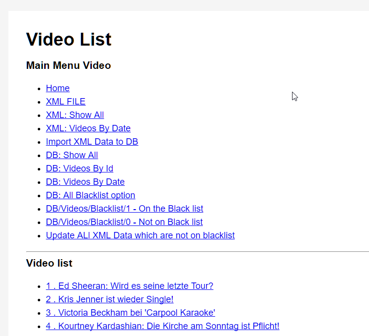
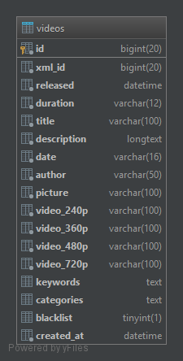

## Task

A Symfony project created on August 10, 2017, 5:28 pm.

[documentation](doc/README.md)

[Testaufgabe PDF](doc/Testaufgabe.pdf)

## Project Steps

### Creating environment
[bitbucket repository](https://bitbucket.org/sapletta/dmwd/)

[install symfony](https://symfony.com/doc/current/setup.html)

    symfony new dmwd
    
[public server](https://symfony.com/doc/current/setup/built_in_web_server.html)
    
    sudo php bin/console server:run 0.0.0.0:81
    sudo php bin/console server:start 0.0.0.0:81
    sudo php bin/console server:status 192.168.188.34:81
    sudo php bin/console server:stop

### Routing
https://symfony.com/doc/current/routing.html
    
    app/config/routing.yml

+ Create list by Date in XML
+ View
+ Controller
+ Library for XML parsing

### Serializer
https://symfony.com/doc/current/serializer.html

    composer require symfony/serializer

### Config

    app/config/config.yml

### Implementation of Task

+ creating the data model for xml
+ creating the Controller
+ creating the View

## Project Pages

[home](http://192.168.188.34:81/)

#### XML

[list ALL from XML](http://192.168.188.34:81/xml/all)

[list by Data from XML](http://192.168.188.34:81/xml/list)

[video from XML](http://192.168.188.34:81/xml/video)

[import xml to db](http://192.168.188.34:81/xml/import/1)

### DB

[list from DB](http://192.168.188.34:81/db/list)
[video from DB](http://192.168.188.34:81/db/video)

Current version is working direct from XML file,

## Mysql Implementation

Tables
    + video
        + keywords
        + categories           

[uml](doc/dmwd.uml)

#### Mysql Table structure

[sql Tables](doc/dmwd.sql)

#### Mysql Data

[sql dmwd_video](doc/dmwd_videos.sql)

## Mysql and Symfony

[doctrine](https://symfony.com/doc/current/doctrine.html)

Edit File:
app/config/parameters.yml

    parameters:
        database_host: 127.0.0.1
        database_port: 3306
        database_name: dmwd
        database_user: root
        database_password: root

Console

    sudo php bin/console doctrine:database:create
    

    #sudo php bin/console doctrine:generate:entity
    
### How to Generate Entities from an Existing Database    
https://symfony.com/doc/current/doctrine/reverse_engineering.html

Create All Tables as XML config
    
    sudo php bin/console doctrine:mapping:import --force AppBundle xml

generate entity classes with annotation mappings

    sudo php bin/console doctrine:mapping:convert annotation ./src
    

php bin/console doctrine:generate:entities AppBundle
php bin/console doctrine:mapping:convert annotation ./src

## Blacklist
 
    http://192.168.188.34:81/db/blacklist/0

## Update Data

